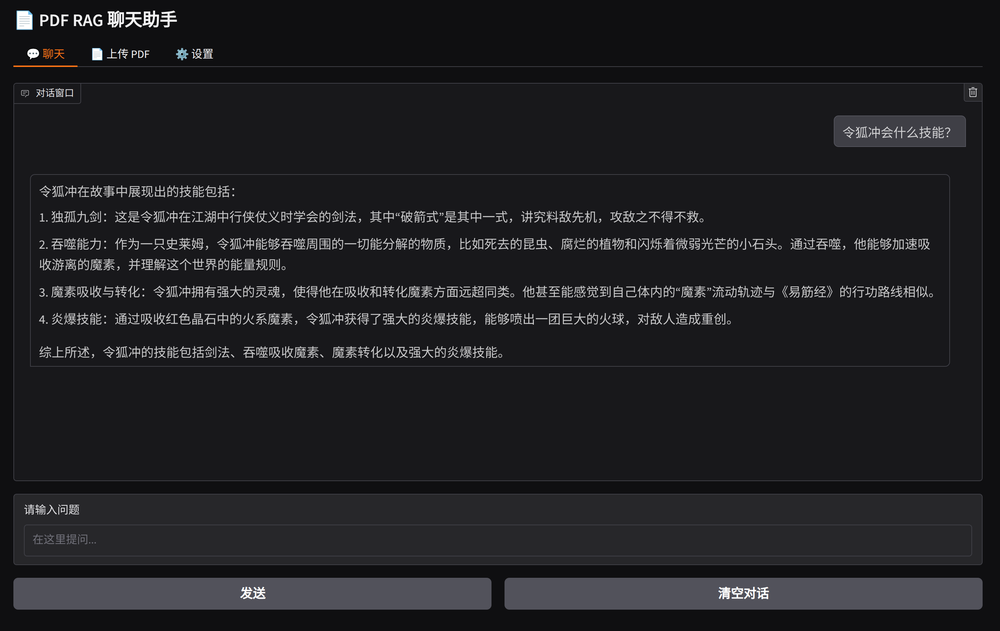
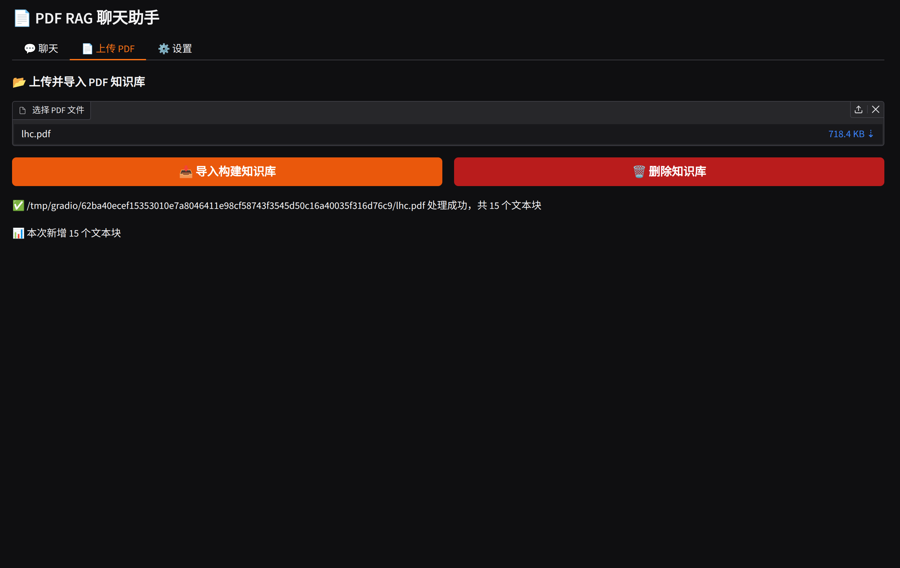
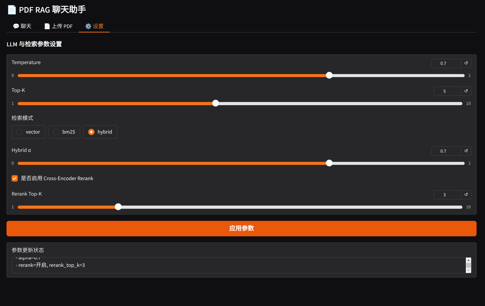

# PDF Chat

学习和理解RAG（Retrieval-Augmented Generation，检索增强生成）技术


## 核心功能

- PDF文档处理：上传并处理PDF文档，自动分割和向量化。
- 智能问答：基于本地文档的精准问答能力。
- 混合检索：结合FAISS进行语义检索和BM25进行关键词检索，提高检索召回率和准确性。
- 结果重排序：交叉编码器（CrossEncoder）和LLM对检索结果进行重排序，优化相关性。
- 用户友好界面：基于Gradio构建交互式Web界面，方便文档上传、提问和结果查看。


## 使用方法

### 安装

1. 下载 uv (A fast Python package installer and resolver):
    ```bash
    curl -LsSf https://astral.sh/uv/install.sh | sh
    ```
2. 克隆仓库：
    ```
    git clone https://github.com/MoleSir/pdf-chat.git
    cd pdf-chat
    ```
3. 创建新的虚拟环境并激活：
    ```
    uv venv --python 3.12
    source .venv/bin/activate  # On Unix/macOS
    # Or on Windows:
    # .venv\Scripts\activate
    ```
4. 下载依赖（需要一段时间）：
    ```
    uv pip install -r requirements.txt
    ```

### 配置

本项目需要配置 LLM APIs。以下是一些步骤来设置你自己的配置：

1. 在 `config` 目下创建 `config.toml` 文件（可以拷贝模板）：
    ```
    cp config/config.example.toml config/config.toml
    ```
2. 编辑 `config/config.toml` 自定义自己的配置：
    ```toml
    # Global LLM configuration
    [llm]
    chat_model = "gpt-4o"
    base_url = "https://api.openai.com/v1"
    api_key = "sk-..."  # Replace with your actual API key
    ```

### 启动服务

```
uv run main.py
```

第一次启动会下载一些模型，需要等待一段时间。服务启动后，自动在浏览器中打开。


## 使用展示

### 聊天



### PDF 上传



### 设置参数




## LICENSE

MIT


## References

- https://github.com/weiwill88/Local_Pdf_Chat_RAG